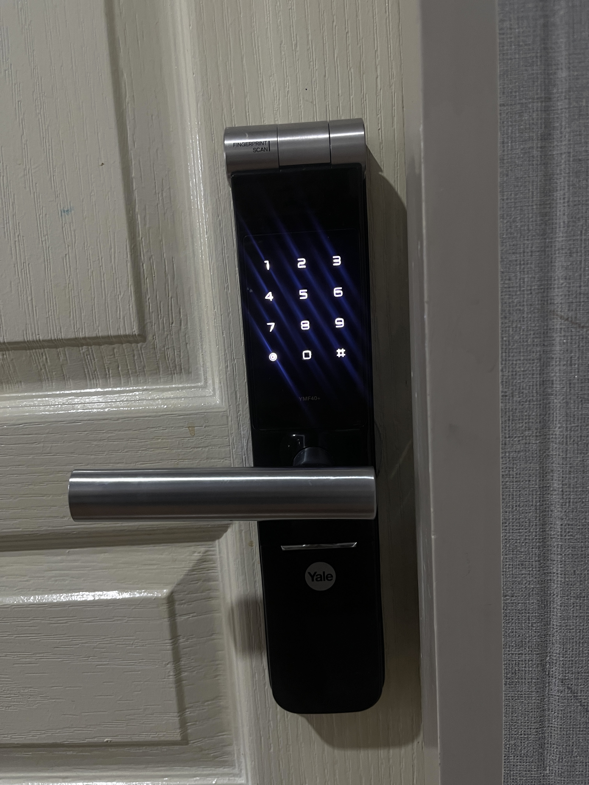

🔰𝗦𝗲𝗰𝘂𝗿𝗶𝘁𝘆 𝗖𝗼𝗻𝘁𝗿𝗼𝗹

𝘿𝙞𝙜𝙞𝙩𝙖𝙡 𝘿𝙤𝙤𝙧 𝙇𝙤𝙘𝙠 

เป็นการล็อคประตูเเละควบคุมการเข้าออก ภายนอก ภายใน ด้วยระบบกุญแจอิเล็กทรอนิกส์ที่ใช้ในการเข้าถึงและควบคุมการเปิดปิดประตู โดยใช้เทคโนโลยีดิจิตอลและระบบสื่อสารเพื่อรับรองตัวตนและอนุญาตการเข้าถึง 
เป็นการแทนที่กุญแจแบบดั้งเดิมและสามารถตั้งรหัสผ่านด้วยเทคโนโลยีที่มีความปลอดภัยมากขึ้น เช่น

🔓รหัสผ่านตัวเลข

🔍ระบบสแกนลายนิ้วมือ 

🧑🏼‍🦱แม้กระทั่งระบบตรวจจับใบหน้า

ผู้ใช้สามารถเปิดปิดประตูได้ผ่านทางอุปกรณ์เช่นแผงควบคุมที่ติดตั้งอยู่ที่ประตูหรือผ่านทางแอปพลิเคชันบนสมาร์ทโฟนของพวกเขา
สิ่งที่ต้องการคือการติดตั้งอุปกรณ์สำหรับควบคุมการเปิดปิดดิจิตอลดอร์ล็อกและระบบรักษาความปลอดภัยอื่น ๆ เช่น รหัสผ่าน 
การตรวจสอบนิ้วมือ หรือการระบุตัวตนผ่านแอปพลิเคชันบนสมาร์ทโฟนของคุณ 

เหตุผลที่ควรใช้ 𝘿𝙞𝙜𝙞𝙩𝙖𝙡 𝘿𝙤𝙤𝙧 𝙇𝙤𝙘𝙠
1. ลดความเสี่ยงจากการโจรกรรม – ระบบล็อกที่แข็งแกร่งกว่ากุญแจทั่วไป ป้องกันการงัดแงะและการทำสำเนากุญแจ

2. ตอบโจทย์ไลฟ์สไตล์ยุคใหม่ – เหมาะกับคนที่ชอบความสะดวก รวดเร็ว และไม่ต้องการพกพากุญแจตลอดเวลา

3. ช่วยจัดการเรื่องความปลอดภัยของคนในบ้าน – สามารถตั้งค่าการเข้าถึงของสมาชิกแต่ละคน และป้องกันบุคคลภายนอก

4. เพิ่มมูลค่าให้กับทรัพย์สิน – บ้านหรือคอนโดที่ติดตั้งระบบล็อกดิจิทัล มักมีมูลค่าสูงขึ้นและดูทันสมัยมากขึ้น

5. เหมาะสำหรับธุรกิจและที่พักอาศัย – ช่วยลดปัญหาการเปลี่ยนกุญแจเมื่อมีการเปลี่ยนผู้พักอาศัย เช่น โรงแรม หอพัก หรือออฟฟิศ

6. 𝙘𝙤𝙣𝙩𝙧𝙤𝙡 𝙁𝙪𝙣𝙘𝙩𝙞𝙤𝙣 ▶️ 𝙋𝙧𝙚𝙫𝙚𝙣𝙩𝙖𝙩𝙞𝙫𝙚

7. 𝙏𝙮𝙥𝙚 𝙎𝙚𝙘𝙪𝙧𝙞𝙩𝙮 𝘾𝙤𝙣𝙩𝙧𝙤𝙡 ▶️ 𝙋𝙝𝙮𝙨𝙞𝙘𝙖𝙡 𝘾𝙤𝙣𝙩𝙧𝙤𝙡
  
